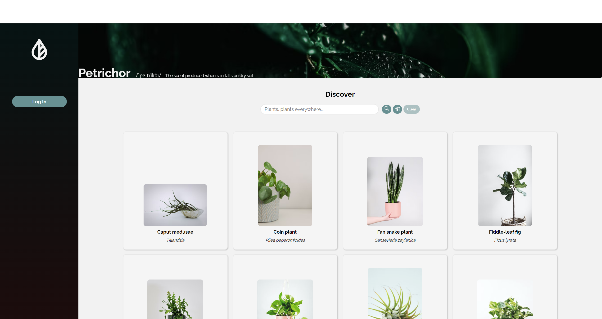
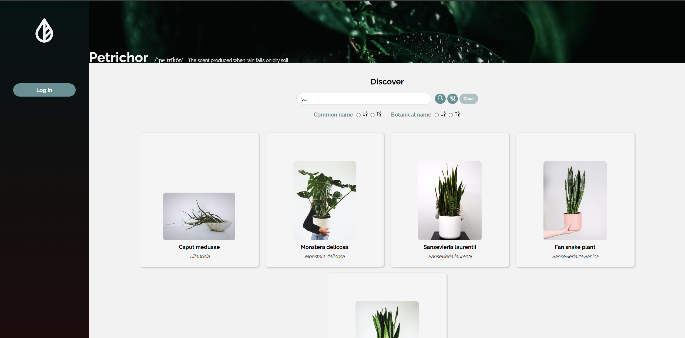
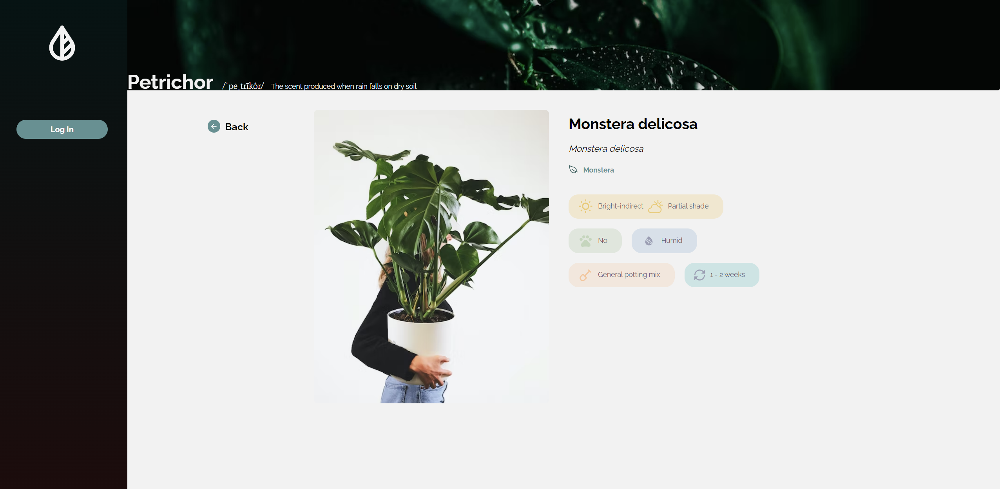
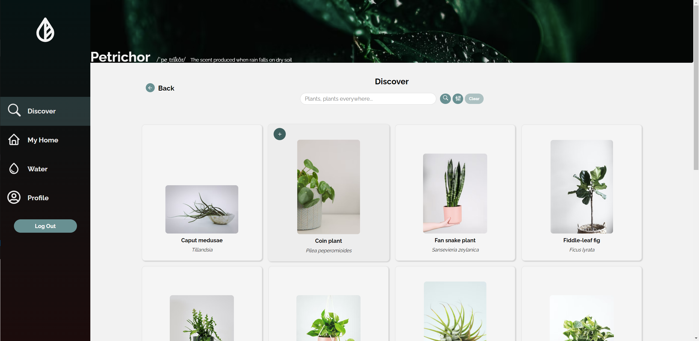
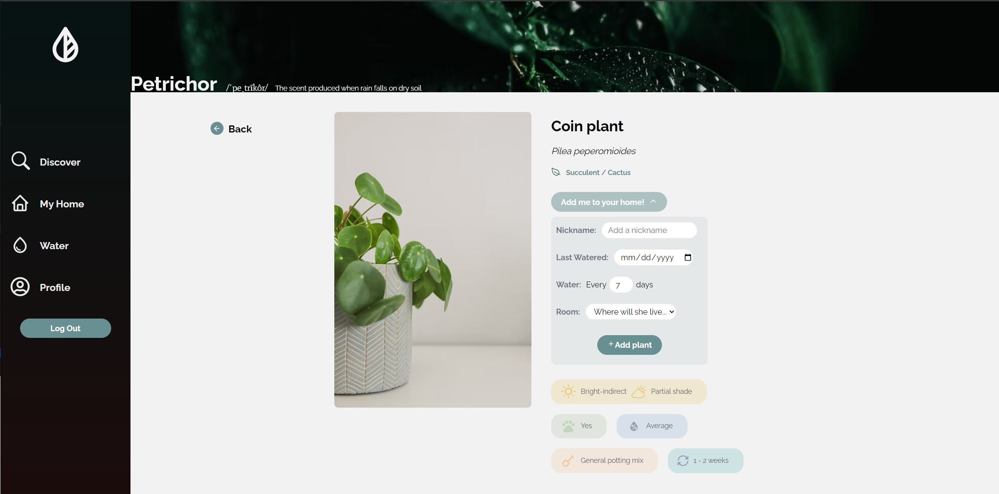
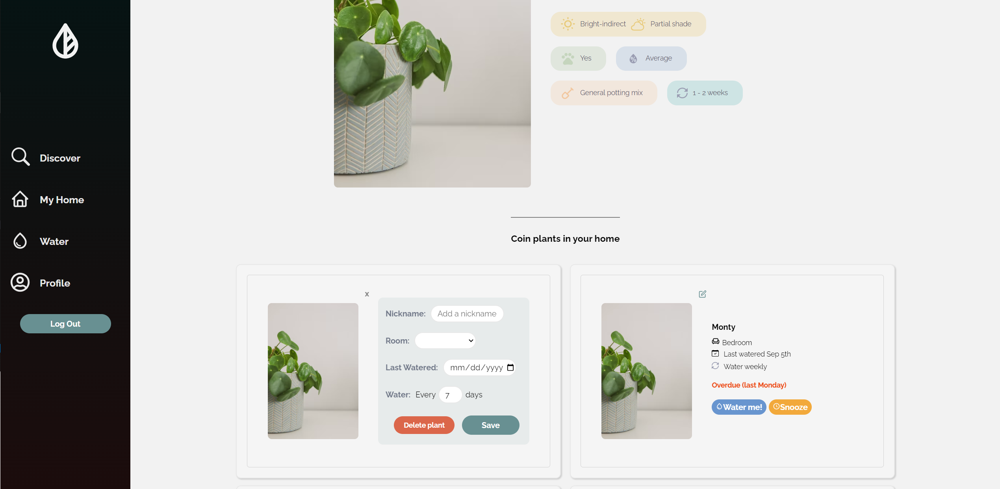
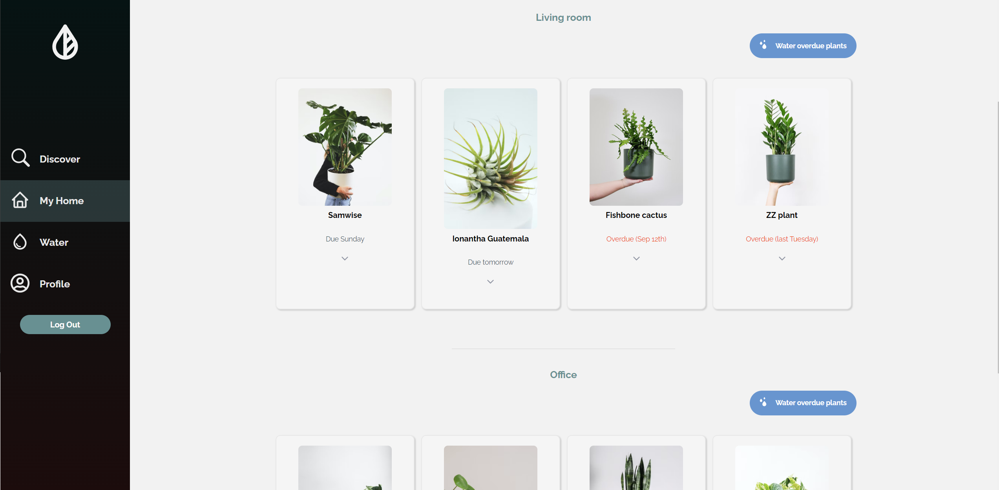
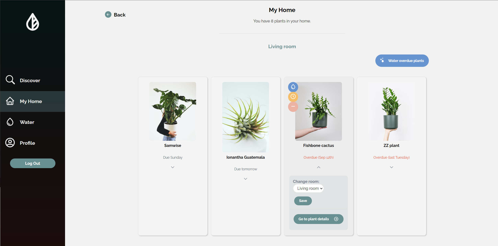
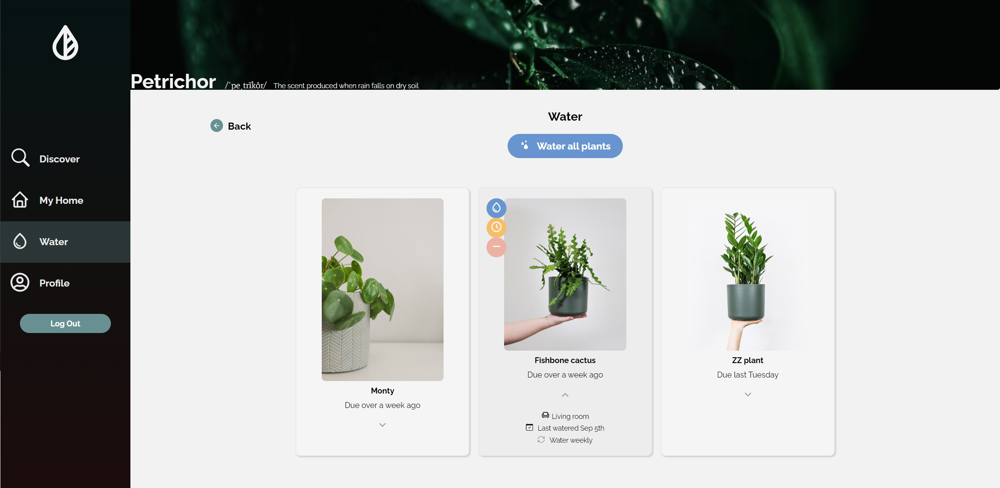
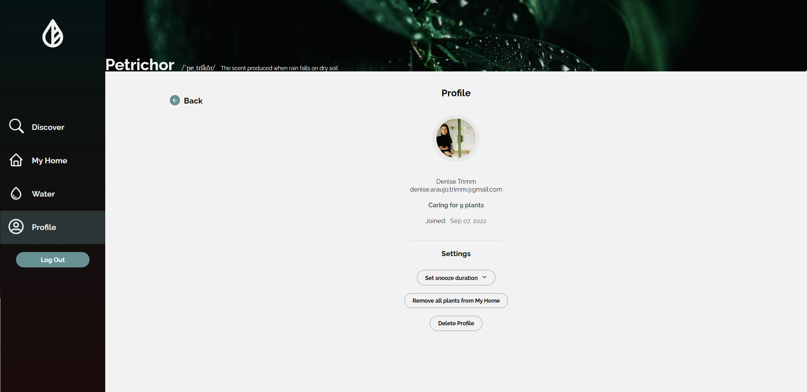

# Petrichor 🪴🌿

## About

The term "Petrichor" refers to the scent produced when rain falls on dry soil. 

This application allows users to track the watering schedules of their plants.

Users can log in with their Google account and add plants to their home space, move plants to different rooms, see when each plant is due for water and either water or snooze it.

Things to note:

* This project was created with the MERN stack.
* I created the plant database from scratch. There are currently 16 available houseplants to choose from. 
* I plan on adding functionality to allow users to create new plants and upload photos of their own houseplants.
 ---

## Setup prerequisites
* Working knowledge of MongoDB and an active account
* A fork of this repository

## Getting started

### Install yarn packages
In your code editor:
* `cd` into the `server` folder and enter `yarn install`.
* `cd` into the `client` folder and enter `yarn install`.

### Set up MongoDB database
In MongoDB
* Create a new MongoDB database.
* From the database page, click **Connect**, then select **Connect your application**.
* Ensure the driver is set to *Node.js*, version *4.1 or later*.
* Take note of your connection string for the following steps.
  
For more information about connecting to the database, [review the MongoDB documentation](https://www.mongodb.com/docs/atlas/driver-connection/).
  
In your code editor:
* Create a `.env` file in the project's `server` folder.
* Add the following passkey and save the file:

        MONGO_URI=<connectionString>

  **Note:** Ensure that the user, database, and password in the connection string are correct. You will need to replace the placeholder \<password> with your real password.
* Use node to run the `server/batchImport.js` file

The `plants.json` data is now available in your database.

### Spin up project

* `cd` into the `server` folder and enter `yarn start`
* `cd` into the `client` folder and enter `yarn start`

🪴Enjoy!🪴

---
## Features and functionality

### Without signing in:

### Discover page


 
Search, filter, and sort plants by their common or botanical name.



### Plant details page

Click on a plant to see additional details and care requirements.



### After signing in:

Note: Authentication is through Google using the Auth0 provider.

Hovering over a plant card allows you to access the **quick add** button.



### Plant Details Page (signed in)

The Plant Details page allows you to enter additional details before adding the plant to your home



Existing plants of that type in your home are also listed and editable



### My Home page 

View plants by room. Clicking **Water overdue plants** only waters plants *in that room* that are due today or past due.



Water, snooze, delete, or update the room of an individual plant by hovering over it and clicking the appropriate action.



### Water page

View all plants that are due today or past due. Click **Water all plants** to water every plant listed. Water, snooze, or delete an individual plant by hovering over it and clicking the appropriate action.


### Profile page

View profile details and edit the snooze duration for all plants. Delete all plants or user profile.



---
## Endpoints 

### Plant endpoints

| Endpoint | Method | Description            |
| -------- | ------ | ---------------------- |
| `/get-plants`  | `GET`  | This endpoint returns an array of all plants. |
| `/get-plant/:plantId`  | `GET`  | This endpoint returns the plant object based on the provided `plantId`. |


### User endpoints

| Endpoint | Method | Description            |
| -------- | ------ | ---------------------- |
| `/get-user/:userId`  | `GET`  | This endpoint returns the user object based on the provided `userId`. |
| `/login-user`  | `POST`  | This endpoint accepts data in the body and checks whether the user is new. If the user exists, it returns the existing user data. If the user is new, it creates a new user and returns the created user data. |
| `/delete-user/:userId`  | `DELETE`  | This endpoint deletes an existing user based on the provided `userId`. |


### Houseplant endpoints

| Endpoint | Method | Description            |
| -------- | ------ | ---------------------- |
| `/add-user-plant`  | `POST`  | This endpoint accepts plant and user data in the body and checks if the user exists. If the user exists, it adds a new houseplant to the user and returns the updated user data. |
| `/update-single-houseplant`  | `PATCH`  | This endpoint accepts plant and user data in the body and checks if the user/houseplant exists. If they both exist, it updates the houseplant with the additional data and returns the user details. This endpoint updates the following houseplant fields: `nickname`, `lastWatered`, `wateringFrequency`, `nextWatering`, `room`. |
| `/update-plant-room`  | `PATCH`  | This endpoint accepts the houseplant `_id` and user `_id` and new `room` data in the body and checks if the user/houseplant exists. If they both exist, it updates the houseplant with the new room and returns the user details. This endpoint only updates the `room` field. |
| `/water-plant`  | `PATCH`  | This endpoint accepts the houseplant `_id` and user `_id` data in the body and checks if the user/houseplant exists. If they both exist, it sets the `lastWatered` field to the current date and updates the `nextWatering` date according to the houseplant's `wateringFrequency`.|
| `/snooze-plant`  | `PATCH`  | This endpoint accepts the houseplant `_id` and user `_id` data in the body and checks if the user/houseplant exists. If they both exist, it updates the `nextWatering` date according to the user's `snooze` value. If the plant is overdue (i.e. `nextWatering` date is in the past), it adds the snooze value to the current date.|
| `/set-snooze`  | `PATCH`  | This endpoint accepts the user `_id` and `snooze` duration data in the body and checks if the user exists. If they exist, it updates the `snooze` field according to the provided snooze duration. This value is applied to all snoozed houseplants.|
| `/delete-user-plant/:houseplant_id?_id=userId`  | `DELETE`  | This endpoint deletes an existing user houseplant based on the provided houseplant `_id`. This endpoint takes an additional `_id` query that corresponds to the user's `_id`. Note: This **does not** use the original base plant `_id` from the `plants` collection.  |
| `/delete-user-plants/:userId`  | `DELETE`  | This endpoint removes all houseplants from the user's `houseplants` array. |

---
## Database collections

### `plants` collection (plants.json) 

The following is an example of a single JSON **plant** object.

| Element | Type | Description            |
| -------- | ------ | ---------------------- |
|_id| string | Unique identifier generated by the `uuid` package. |
|commonName| string | Commonly used name for the plant. |
|botanicaName| string | Official latin botanical name. |
|additionalNames| array | (Optional) List of other commonly used names if applicable. |
|family| string | Plant family this plant belongs to. |
|wateringFrequency| number | Number of days between waterings. Most plants start at 7 days (weekly). |
|humidityLevel| string | Humidity requirements for the plant. Options are: *dry*, *average*, and *humid*. |
|sunlightRequirements| string | Sunlight requirements for the plant. Options are: *bright-indirect*, *partial shade*, and *low*. |
|soilRequirements| string | Soil requirements for the plant. Options are: *normal*, *sandy*, *moist*, and *none*. |
|petFriendly| string | Indicates whether the plant is safe for pets. Options are: *yes* and *no*.|
|imgSrc| string | URL to the plant image. |


```json
[
    {
        "_id":"0918e6f3-a40e-4316-91d3-03e70e152803",
        "commonName":"Coin plant",
        "botanicalName":"Pilea peperomioides",
        "additionalNames":["Chinese money plant"],
        "family":"Succulent / Cactus",
        "wateringFrequency":{"$numberInt":"7"},
        "humidityLevel":"Average",
        "sunlightRequirements":"bright-indirect, partial shade",
        "soilRequirements":"General",
        "petFriendly":"Yes",
        "imgSrc":"https://images.unsplash.com/photo-1559141865-89ac060391b4?ixlib=rb-1.2.1&ixid=MnwxMjA3fDB8MHxzZWFyY2h8MTF8fHBpbGVhJTIwcGVwZXJvbWlvaWRlc3xlbnwwfHwwfHw%3D&auto=format&fit=crop&w=500&q=60"
        }
]
```
### `users` collection (created on first login)

The following is an example of a single JSON **user** object.

| Element | Type | Description            |
| -------- | ------ | ---------------------- |
|_id| string | Unique identifier generated by the `uuid` package. |
|dateJoined| string | Date user is created. Date is generated by the `moment.js` package. |
|given_name| string | User's first name. This is provided by Auth0 on Google sign-in. |
|family_name| string | User's last name. This is provided by Auth0 on Google sign-in. |
|email| string | User's email. This is provided by Auth0 on Google sign-in. |
|houseplants| array | Lists the houseplant objects. To view additional details, see the houseplants JSON object. |
|home| object | Lists rooms in the house. Options are: *basement, bathroom, bedroom, entrance, kitchen, livingRoom, office, studio, tvRoom*, and *other*.|
|snooze| number | Number of days to add to the `nextWatering` date. If the plant is overdue (i.e. `nextWatering` date is in the past), the snooze value is added to the current date.|

The following is an example of a single JSON **houseplant** object. 

| Element | Type | Description            |
| -------- | ------ | ---------------------- |
| -------- | ------ |  **Note:** Each houseplant object also contains generic plant information. To see the description for these fields, [see  the plants collection](#plants-collection-plantsjson). |
|_id| string | Used to identify the unique houseplant. This is a different `_id` than the plants collection `_id`. Unique identifier is generated by the `uuid` package. |
|plantId| string | This is the original plants collection `_id`. Unique identifier is generated by the `uuid` package. |
|dateAdded| string | Date houseplant is created. Date is generated by the `moment.js` package.  |
|lastWatered| string | Date the houseplant was last watered. Defaults to the current date when plant is created.|
|nextWatering| string | Date the houseplant should be watered based on the `wateringFrequency` and any `snooze` actions. |
|room| string | (Optional) Room the plant is in. Default is `""`.|
|nickname| string | (Optional) Nickname for the plant. Default is `""`.|

```json
[
    {
        "_id":"15ad6449-a280-4433-921b-0ccf99ef9c34",
        "dateJoined":"2022-09-07T14:40:47-04:00",
        "given_name":"Denise",
        "family_name":"Trimm",
        "email":"denise.araujo.trimm@gmail.com",
        "houseplants":[
            {
                "_id":"45571dc1-3110-45d7-b17d-372ef929829d",
                "commonName":"Coin plant",
                "botanicalName":"Pilea peperomioides",
                "additionalNames":["Chinese money plant"],
                "family":"Succulent / Cactus",
                "wateringFrequency":{"$numberInt":"7"},
                "humidityLevel":"Average",
                "sunlightRequirements":"bright-indirect, partial shade",
                "soilRequirements":"General",
                "petFriendly":"Yes",
                "imgSrc":"https://images.unsplash.com/photo-1559141865-89ac060391b4",
                "plantId":"0918e6f3-a40e-4316-91d3-03e70e152803",
                "dateAdded":"2022-09-16T13:02:44-04:00",
                "lastWatered":"2022-09-05",
                "nextWatering":"2022-09-12T00:00:00-04:00",
                "room":"office",
                "nickname":"Monty"
            },
            {
                "_id":"34bb36b9-7552-4bef-979d-e700b555e490",
                "commonName":"Fishbone cactus",
                "botanicalName":"Disocactus anguliger",
                "additionalNames":[
                    "Zigzag cactus",
                    "Ricrac cactus",
                    "Orchid cactus"
                ],
                "family":"Succulent / Cactus",
                "wateringFrequency":{"$numberInt":"7"},
                "humidityLevel":"Humid",
                "sunlightRequirements":"bright-indirect",
                "soilRequirements":"Sandy",
                "petFriendly":"Yes",
                "imgSrc":"https://images.unsplash.com/photo-1638435055217-5aef25d1982b",
                "lastWatered":"2022-09-19T02:24:12-04:00",
                "plantId":"92513b57-1296-4aaf-98cb-1a356fab8866",
                "dateAdded":"2022-09-19T00:34:02-04:00",
                "nextWatering":"2022-09-26T02:24:12-04:00",
                "room":"livingRoom",
                "nickname":""
            }
        ],
        "home":{
            "basement":"Basement",
            "bathroom":"Bathroom",
            "bedroom":"Bedroom",
            "entrance":"Entrance",
            "kitchen":"Kitchen",
            "livingRoom":"Living room",
            "office":"Office",
            "studio":"Studio",
            "tvRoom":"TV room",
            "other":"Other"
        },
        "snooze":"4"
    }
]
```
---

## Attribution

<a href="https://www.flaticon.com/free-icons/leaf" title="leaf icons">Leaf icons created by Freepik - Flaticon</a>
<br>
<a href="https://feey.ch/" title="feey">Plant images by Freepik - Unsplash</a>